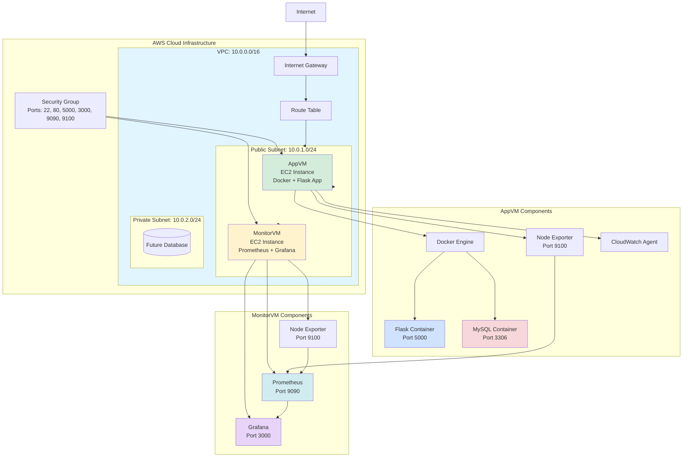
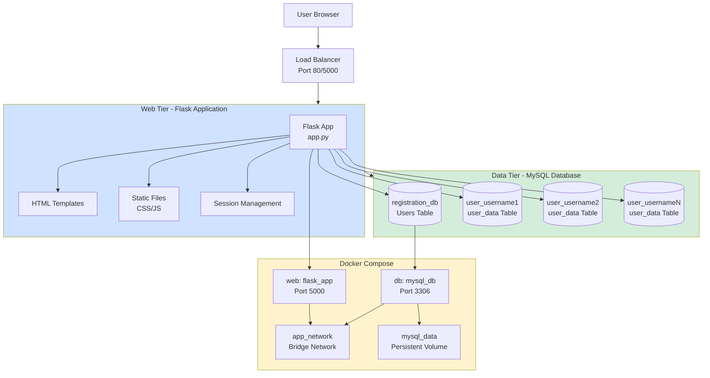
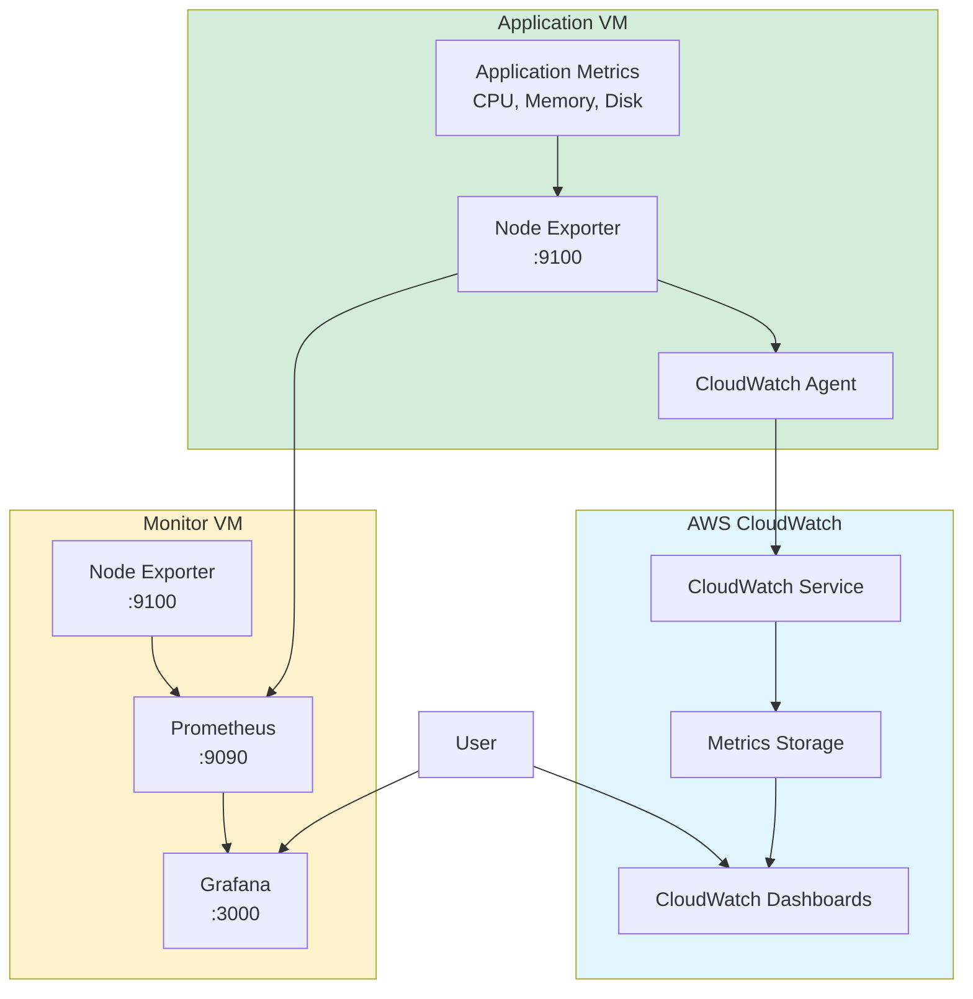

# DevOps 2-Tier Project - Complete CI/CD Pipeline

## 📋 Table of Contents
- [Project Overview](#project-overview)
- [Architecture](#architecture)
- [Project Structure](#project-structure)
- [Technology Stack](#technology-stack)
- [Workflow Diagrams](#workflow-diagrams)
- [Components Details](#components-details)
- [Prerequisites](#prerequisites)
- [Setup Instructions](#setup-instructions)
- [Usage Guide](#usage-guide)
- [Monitoring](#monitoring)

---

## 🎯 Project Overview

This project implements a complete **DevOps CI/CD pipeline** for deploying a **2-tier Flask web application** with MySQL database on AWS infrastructure. The project demonstrates Infrastructure as Code (IaC), Configuration Management, Containerization, and Continuous Integration/Continuous Deployment practices.

### Key Features:
- ✅ **Infrastructure Automation**: AWS VPC, EC2 instances provisioned via Terraform
- ✅ **Configuration Management**: Ansible playbooks for automated server configuration
- ✅ **CI/CD Pipeline**: Jenkins multi-stage pipeline for automated deployments
- ✅ **Containerization**: Docker & Docker Compose for application deployment
- ✅ **Monitoring Stack**: Prometheus, Grafana, Node Exporter, and CloudWatch Agent
- ✅ **Web Application**: Flask-based user registration/login system with MySQL
- ✅ **Multi-Database Architecture**: Automatic user-specific database creation

---

## 🏗️ Architecture

### Infrastructure Components:
1. **Base Infrastructure** (`BaseInfrastucture/`): Jenkins server setup
2. **Application Infrastructure** (`Terraform/`): Application and monitoring VMs
3. **Application VM**: Hosts Flask application with Docker containers
4. **Monitor VM**: Hosts Prometheus and Grafana for monitoring

### Application Architecture:
- **Frontend**: HTML/CSS/JavaScript (Flask templates)
- **Backend**: Flask (Python) web framework
- **Database**: MySQL 8.0 (containerized)
- **Containerization**: Docker & Docker Compose

---

## 📁 Project Structure

```
DevOps_2_tier_Project-2/
│
├── 📂 BaseInfrastucture/          # Jenkins Base Infrastructure
│   ├── main.tf                    # Terraform main configuration
│   ├── variables.tf               # Variable definitions
│   ├── provider.tf                # AWS provider configuration
│   ├── backend.tf                 # Terraform backend configuration
│   ├── terraform.tfvars           # Variable values
│   ├── output.tf                  # Output definitions
│   └── jenkins_terraform.sh       # Jenkins installation script
│
├── 📂 Terraform/                  # Application Infrastructure
│   ├── main.tf                    # VPC, Subnets, EC2 instances
│   ├── variables.tf               # Variable definitions
│   ├── provider.tf                # AWS provider configuration
│   ├── backend.tf                 # Terraform backend configuration
│   ├── terraform.tfvars           # Variable values
│   ├── output.tf                  # Outputs (IPs, IDs)
│   ├── ansible.sh                 # Initial setup script
│   └── README.md                  # Terraform documentation
│
├── 📂 ansible/                    # Configuration Management
│   ├── inventory.ini              # Dynamic inventory (generated)
│   ├── app.yml                    # App VM configuration playbook
│   └── monitor.yml                # Monitor VM configuration playbook
│
├── 📂 app/                        # Flask Web Application
│   ├── app.py                     # Main Flask application
│   ├── Dockerfile                 # Flask container definition
│   ├── docker-compose.yml         # Multi-container orchestration
│   ├── requirements.txt           # Python dependencies
│   ├── 📂 templates/              # HTML templates
│   │   ├── index.html             # Welcome page
│   │   ├── login.html             # Login page
│   │   └── registration.html      # Registration page
│   └── 📂 static/                 # Static assets
│       ├── style.css              # CSS styles
│       └── script.js              # JavaScript
│
├── Jenkinsfile-Terraform          # Infrastructure provisioning pipeline
├── Jenkinsfile-Ansible            # Configuration management pipeline
├── Jenkinsfile-Deployment         # Application deployment pipeline
└── README.md                      # This file
```

---

## 🛠️ Technology Stack

### Infrastructure & DevOps:
- **Terraform**: Infrastructure as Code (IaC)
- **Ansible**: Configuration Management
- **Jenkins**: CI/CD Automation
- **AWS**: Cloud Infrastructure (EC2, VPC, Security Groups, S3, Cloudwatch)

### Application Stack:
- **Python 3.10**: Runtime environment
- **Flask 3.0.0**: Web framework
- **MySQL 8.0**: Database server
- **PyMySQL**: MySQL connector
- **Docker**: Containerization
- **Docker Compose**: Multi-container orchestration

### Monitoring Stack:
- **Prometheus**: Metrics collection
- **Grafana**: Visualization & dashboards
- **Node Exporter**: System metrics exporter
- **CloudWatch Agent**: AWS metrics collection

---

## 🔄 Workflow Diagrams

### 1. Complete CI/CD Pipeline Flow

```mermaid
graph TB
    Start([Developer Pushes Code]) --> Git[GitHub Repository]
    Git --> Jenkins[Jenkins Server]
    
    Jenkins --> TF_Pipeline[Terraform Pipeline]
    TF_Pipeline --> TF_Init[Terraform Init]
    TF_Init --> TF_Plan[Terraform Plan]
    TF_Plan --> TF_Apply[Terraform Apply]
    TF_Apply --> CreateVM[Create AppVM & MonitorVM]
    CreateVM --> GenInv[Generate Ansible Inventory]
    GenInv --> PushGit[Push Inventory to GitHub]
    PushGit --> TriggerAnsible[Trigger Ansible Pipeline]
    
    TriggerAnsible --> Ansible_Pipeline[Ansible Pipeline]
    Ansible_Pipeline --> Ansible_Clone[Git Clone]
    Ansible_Clone --> Ansible_Setup[Verify Ansible Setup]
    Ansible_Setup --> App_Playbook[Run app.yml on AppVM]
    App_Playbook --> Monitor_Playbook[Run monitor.yml on MonitorVM]
    Monitor_Playbook --> TriggerDeploy[Trigger Deployment Pipeline]
    
    TriggerDeploy --> Deploy_Pipeline[Deployment Pipeline]
    Deploy_Pipeline --> Deploy_Clone[Git Clone]
    Deploy_Clone --> Validate[Validate Files]
    Validate --> CopyFiles[Copy App Files to AppVM]
    CopyFiles --> VerifyDocker[Verify Docker Environment]
    VerifyDocker --> StopContainers[Stop Existing Containers]
    StopContainers --> BuildImages[Build Docker Images]
    BuildImages --> DeployContainers[Deploy with Docker Compose]
    DeployContainers --> VerifyDeploy[Verify Deployment]
    VerifyDeploy --> Success([Application Deployed])
    
    style Start fill:#e1f5ff
    style Success fill:#d4edda
    style Jenkins fill:#fff3cd
    style TF_Pipeline fill:#cfe2ff
    style Ansible_Pipeline fill:#d1ecf1
    style Deploy_Pipeline fill:#f8d7da
```



### 2. Infrastructure Architecture



### 3. Application Architecture (2-Tier)



### 4. Jenkins Pipeline Stages

```mermaid
graph LR
    subgraph Pipeline1[Terraform Pipeline]
        TF1[1. Git Clone] --> TF2[2. Terraform Init]
        TF2 --> TF3[3. Terraform Plan]
        TF3 --> TF4[4. Apply/Destroy]
        TF4 --> TF5[5. Generate Inventory]
        TF5 --> TF6[6. Push to GitHub]
    end
    
    subgraph Pipeline2[Ansible Pipeline]
        ANS1[1. Git Clone] --> ANS2[2. Verify Ansible]
        ANS2 --> ANS3[3. Run app.yml]
        ANS3 --> ANS4[4. Run monitor.yml]
        ANS4 --> ANS5[5. Trigger Deployment]
    end
    
    subgraph Pipeline3[Deployment Pipeline]
        DEP1[1. Git Clone] --> DEP2[2. Validate Files]
        DEP2 --> DEP3[3. Copy to AppVM]
        DEP3 --> DEP4[4. Verify Docker]
        DEP4 --> DEP5[5. Stop Containers]
        DEP5 --> DEP6[6. Build Images]
        DEP6 --> DEP7[7. Deploy Containers]
        DEP7 --> DEP8[8. Verify Deployment]
    end
    
    TF6 --> ANS1
    ANS5 --> DEP1
    
    style Pipeline1 fill:#cfe2ff
    style Pipeline2 fill:#d1ecf1
    style Pipeline3 fill:#f8d7da
```



### 5. Monitoring Architecture



---

## 📦 Components Details

### 1. BaseInfrastucture/
**Purpose**: Provisions Jenkins server infrastructure on AWS

**Key Files**:
- `main.tf`: Creates VPC, subnets, security groups, and Jenkins EC2 instance
- `jenkins_terraform.sh`: User data script for Jenkins installation
- `terraform.tfvars`: Configuration values (region, instance type, AMI, etc.)

**Resources Created**:
- VPC with public and private subnets
- Internet Gateway
- Route Tables
- Security Group (ports 22, 80, 8080)
- Jenkins EC2 instance

### 2. Terraform/
**Purpose**: Provisions application and monitoring infrastructure

**Key Files**:
- `main.tf`: Creates VPC, subnets, security groups, AppVM, and MonitorVM
- `ansible.sh`: User data script for initial VM setup
- `output.tf`: Exports AppVM and MonitorVM public IPs

**Resources Created**:
- VPC (10.0.0.0/16)
- Public Subnet (10.0.1.0/24)
- Private Subnet (10.0.2.0/24)
- Internet Gateway
- Route Tables
- Security Group (ports 22, 80, 5000, 3000, 9090, 9100)
- AppVM EC2 instance
- MonitorVM EC2 instance

### 3. ansible/
**Purpose**: Configuration management for application and monitoring servers

**app.yml** - Configures AppVM:
- Installs Docker and Docker Compose
- Installs Node Exporter (system metrics)
- Installs and configures CloudWatch Agent
- Sets up systemd services

**monitor.yml** - Configures MonitorVM:
- Installs Prometheus
- Installs Grafana
- Installs Node Exporter
- Configures systemd services

**inventory.ini** - Dynamic inventory:
- Generated automatically by Terraform pipeline
- Contains AppVM and MonitorVM IPs
- Pushed to GitHub for Ansible pipeline

### 4. app/
**Purpose**: Flask web application with MySQL database

**app.py** - Main application:
- User registration with password hashing
- User login with session management
- Automatic database creation per user
- MySQL connection management
- Database initialization

**Key Features**:
- Secure password hashing (Werkzeug)
- Session-based authentication
- Multi-database architecture (one per user)
- Health checks and retry logic
- Error handling

**Dockerfile**:
- Python 3.10 slim base image
- Installs MySQL client libraries
- Copies application files
- Exposes port 5000

**docker-compose.yml**:
- `web` service: Flask application
- `db` service: MySQL 8.0 database
- Health checks for both services
- Persistent volumes for MySQL data
- Network configuration

**Templates**:
- `login.html`: User login form
- `registration.html`: User registration form
- `index.html`: Welcome page with animations

**Static Files**:
- `style.css`: Modern, animated styling
- `script.js`: Client-side interactions

### 5. Jenkins Pipelines

**Jenkinsfile-Terraform**:
- **Parameters**: `ACTION` (apply/destroy)
- **Stages**:
  1. Git Clone
  2. Terraform Init
  3. Terraform Plan
  4. Terraform Apply/Destroy
  5. Generate Ansible Inventory
  6. Push Inventory to GitHub
- **Post Actions**: Triggers Ansible pipeline on success

**Jenkinsfile-Ansible**:
- **Stages**:
  1. Git Clone
  2. Verify Ansible Setup
  3. Run app.yml on AppVM
  4. Run monitor.yml on MonitorVM
  5. Trigger Deployment Pipeline
- **Credentials**: Uses SSH key for Ansible connections

**Jenkinsfile-Deployment**:
- **Parameters**: `ACTION` (up/down)
- **Stages**:
  1. Git Clone
  2. Validate Configuration Files
  3. Copy App Files to AppVM
  4. Verify Docker Environment
  5. Stop Existing Containers
  6. Build Docker Images
  7. Deploy with Docker Compose
  8. Verify Deployment
  9. (Optional) Docker Compose Down
  10. Deployment Summary
- **Post Actions**: Success/failure notifications

---

## 🔧 Prerequisites

### Required Software:
- **Terraform** >= 1.0
- **Ansible** >= 2.9
- **Jenkins** >= 2.400
- **Docker** >= 20.10
- **Docker Compose** >= 2.0
- **AWS CLI** configured with credentials
- **Git** for version control

### AWS Requirements:
- AWS Account with appropriate permissions
- EC2 Key Pair for SSH access
- S3 bucket for Terraform backend (optional)
- IAM roles with EC2, VPC, and S3 permissions

### Jenkins Plugins:
- Git Plugin
- Ansible Plugin
- Docker Pipeline Plugin
- Credentials Plugin
- GitHub Integration Plugin

### Jenkins Credentials:
- `GitHub-cred`: GitHub username/password for repository access
- `ansible-ssh`: SSH private key for Ansible connections

---

## 🚀 Setup Instructions

### Step 1: Base Infrastructure Setup

1. **Configure BaseInfrastucture**:
   ```bash
   cd BaseInfrastucture
   ```

2. **Update terraform.tfvars**:
   ```hcl
   aws_region = "eu-north-1"
   vpc_cidr = "10.0.0.0/16"
   public_subnet_cidr = "10.0.1.0/24"
   private_subnet_cidr = "10.0.2.0/24"
   AppVM = "t2.medium"
   ami = "ami-xxxxx"
   key_name = "your-key-pair"
   ssh_cidr = "0.0.0.0/0"
   availability_zone_1a = "eu-north-1a"
   availability_zone_1b = "eu-north-1b"
   ```

3. **Initialize and Apply**:
   ```bash
   terraform init
   terraform plan
   terraform apply
   ```

4. **Access Jenkins**:
   - Get Jenkins VM IP from Terraform output
   - Access: `http://<jenkins-ip>:8080`
   - Complete Jenkins setup wizard

### Step 2: Configure Jenkins

1. **Install Required Plugins**:
   - Git Plugin
   - Ansible Plugin
   - Docker Pipeline Plugin
   - GitHub Integration

2. **Configure Credentials**:
   - Add GitHub credentials (`GitHub-cred`)
   - Add SSH private key (`ansible-ssh`)

3. **Create Jenkins Jobs**:
   - **Terraform-Pipeline**: Use `Jenkinsfile-Terraform`
   - **Ansible-Pipeline**: Use `Jenkinsfile-Ansible`
   - **Deployment-Pipeline**: Use `Jenkinsfile-Deployment`

### Step 3: Run CI/CD Pipeline

1. **Trigger Terraform Pipeline**:
   - Select `Terraform-Pipeline` job
   - Choose `ACTION = apply`
   - Build the job
   - Pipeline will create infrastructure and trigger Ansible

2. **Ansible Pipeline** (Auto-triggered):
   - Configures AppVM and MonitorVM
   - Installs Docker, Prometheus, Grafana, etc.
   - Triggers Deployment Pipeline

3. **Deployment Pipeline** (Auto-triggered):
   - Copies application files
   - Builds Docker images
   - Deploys containers
   - Verifies deployment

### Step 4: Access Application

- **Flask Application**: `http://<appvm-ip>:5000`
- **Prometheus**: `http://<monitorvm-ip>:9090`
- **Grafana**: `http://<monitorvm-ip>:3000` (default: admin/admin)

---

## 📖 Usage Guide

### Application Usage:

1. **Registration**:
   - Navigate to `/register`
   - Enter username, email, and password
   - System creates user account and dedicated database

2. **Login**:
   - Navigate to `/login`
   - Enter credentials
   - Access welcome page

3. **Logout**:
   - Click logout button
   - Session cleared

### Pipeline Operations:

**Terraform Pipeline**:
- `ACTION = apply`: Create infrastructure
- `ACTION = destroy`: Destroy infrastructure

**Deployment Pipeline**:
- `ACTION = up`: Deploy application
- `ACTION = down`: Stop and remove containers

### Monitoring:

**Prometheus**:
- Access metrics at `http://<monitorvm-ip>:9090`
- Query: `node_cpu_seconds_total`, `node_memory_MemTotal_bytes`

**Grafana**:
- Access dashboards at `http://<monitorvm-ip>:3000`
- Add Prometheus as data source
- Create custom dashboards

**CloudWatch**:
- Access AWS CloudWatch console
- View metrics for AppVM
- Set up alarms and notifications

---

## 📊 Monitoring

### Metrics Collected:

**Node Exporter** (Port 9100):
- CPU usage
- Memory usage
- Disk I/O
- Network statistics
- System load

**CloudWatch Agent**:
- EC2 instance metrics
- Custom application metrics
- Log aggregation

**Prometheus**:
- Scrapes Node Exporter endpoints
- Stores time-series data
- Provides query language (PromQL)

**Grafana**:
- Visualizes Prometheus metrics
- Creates dashboards
- Sets up alerts

### Default Ports:

- **Flask App**: 5000
- **MySQL**: 3306
- **Prometheus**: 9090
- **Grafana**: 3000
- **Node Exporter**: 9100
- **SSH**: 22
- **HTTP**: 80

---

## 🔒 Security Considerations

1. **Password Security**: Uses Werkzeug password hashing
2. **Session Management**: Flask sessions with secret key
3. **Database Security**: MySQL root password in environment variables
4. **Network Security**: Security groups restrict access
5. **SSH Access**: Key-based authentication only
6. **Secrets Management**: Use AWS Secrets Manager or Jenkins credentials

---

## 🐛 Troubleshooting

### Common Issues:

1. **Terraform Backend Error**:
   - Check S3 bucket exists and is accessible
   - Verify AWS credentials

2. **Ansible Connection Failed**:
   - Verify SSH key is correct
   - Check security group allows SSH (port 22)
   - Ensure VMs are running

3. **Docker Build Failed**:
   - Check Dockerfile syntax
   - Verify requirements.txt is correct
   - Check disk space on AppVM

4. **Application Not Accessible**:
   - Verify security group allows port 5000
   - Check container logs: `docker-compose logs`
   - Verify MySQL container is healthy

5. **Monitoring Not Working**:
   - Check Prometheus targets: `http://<monitorvm-ip>:9090/targets`
   - Verify Node Exporter is running: `systemctl status node_exporter`
   - Check firewall rules

---

## 📝 Notes

- Inventory file (`ansible/inventory.ini`) is auto-generated by Terraform pipeline
- Each user gets a dedicated database (`user_<username>`)
- Docker Compose manages application lifecycle
- All pipelines are chained for automated deployment
- Monitoring stack provides observability across infrastructure

---

## 👥 Contributors

- Project maintained by DevOps team
- For issues or questions, please create an issue in the repository

---

## 📄 License

This project is for educational and demonstration purposes.

---

## 🔗 Related Documentation

- [Terraform Documentation](https://www.terraform.io/docs)
- [Ansible Documentation](https://docs.ansible.com)
- [Jenkins Documentation](https://www.jenkins.io/doc)
- [Docker Documentation](https://docs.docker.com)
- [Flask Documentation](https://flask.palletsprojects.com)

---

**Last Updated**: 2025
**Version**: 2.0
**Copy Right - Dipesh.**
